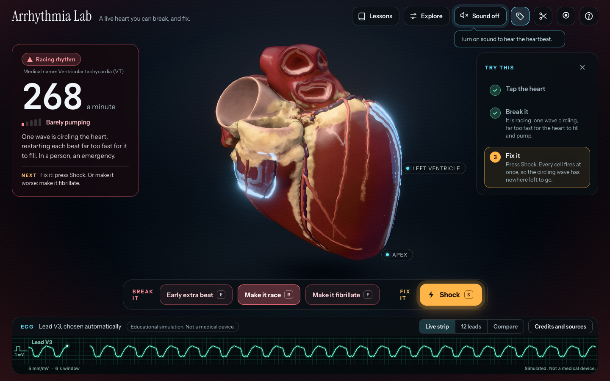

# Arrhythmia Lab

**A live heart you can break, and fix.** A real 3D heart, rebuilt from a CT scan, that beats on your graphics card. Press
**Make it race** and one wave starts chasing its own tail. Press **Make it fibrillate** and it shatters into chaos and the
heart stops pumping. Press **Shock** and it comes back. The ECG is computed from the simulation as it runs, and you can
turn on a heartbeat that follows whatever the heart is doing. Free, in your browser. Nothing is uploaded, nothing is tracked.

**Live: https://arrhythmia-lab.pages.dev**

> **Educational simulation. Not a medical device.** It never reads your ECG, your scans or your health data, it gives
> no advice, and its tissue is idealised. See [What it is and is not](#what-it-is-and-is-not).



## What you can do

Start with the three-step card in the corner: **tap the heart, break it, fix it.**

- **Break it.** Three buttons at the bottom: *Early extra beat* (it settles by itself; occasional ones are common and usually harmless), *Make it race*
  (ventricular tachycardia, a wave circling the heart) and *Make it fibrillate* (ventricular fibrillation, no pumping at all).
- **Fix it.** *Shock* works the way a defibrillator does: every cell fires at once, so a circling or chaotic wave has nowhere
  left to go. Like a real AED it reads the rhythm first: it shocks only the racing rhythm or fibrillation, and refuses a steady rhythm or a
  still heart, saying why. After a shock the steady beat comes back on its own here; in a person it does not always.
- **Read it.** A card names the rhythm in plain words (with the medical name under it), shows the rate, how well the heart is
  pumping, one sentence about what is happening, and what to try next.
- **Hear it.** Turn on **Sound** (or press M). Each beat is a *lub* and a *dub*, made from the simulated muscle: an early beat
  is softer, a racing heart is a quick thump per turn, a shock plays a thud and a crackle (a sound effect, not a heart sound), and fibrillation is silent, because a quivering heart
  has no beat to hear. It is synthesised live in your browser, not recorded, and off until you ask for it.
- **See the ECG.** One big strip that picks the lead that shows the rhythm best (and says which), all 12 leads, and **Compare**,
  which puts real recorded ECGs (a normal rhythm, extra beats, ventricular tachycardia, real ventricular fibrillation, and atrial
  fibrillation, labelled as a different condition) next to the simulated one.
- **Learn.** Five short lessons: one beat, an early beat, the racing rhythm, fibrillation, and the shock that stops it.
- **Explore.** Tap anywhere on the muscle to start a beat there. Two tissue sliders (how fast the wave travels, how long each
  cell needs to recover) decide whether a wave can chase its own tail. Cut the heart open to see the wave move through the wall.
  Slow motion. Name the parts.
- **Record a clip** of the heart and the ECG, with the sound, saved on your computer.

Keys: **E** early beat, **R** race, **F** fibrillate, **S** shock, **B** one beat, **M** sound.

## How it works, in plain English

1. **A real heart.** The shape comes from a CT scan of a real heart, published with permission as an anonymised model
   ([Strocchi et al., CC BY 4.0](https://zenodo.org/records/3890034)). Its two lower chambers are cut into 182,253
   one-millimetre cubes, each knowing which way its muscle fibres run. Electricity travels about three times faster along the
   fibres than across them. The upper chambers and the great vessels come from the same scan and are drawn, not simulated.
2. **A real cell model.** Every cube runs the minimal ventricular cell model of
   [Bueno-Orovio, Cherry and Fenton (2008)](https://doi.org/10.1016/j.jtbi.2008.03.029), written here from the paper: four
   numbers per cell that rise and fall like a real heart cell's voltage. Inner, middle and outer layers of the wall get different settings.
3. **A live solver on the graphics card.** Neighbouring cubes pass current to each other through the faces they share.
   Each face's flow is worked out once and added to one cube and taken from the other, so no current is created or lost at the
   edge of the muscle. A test proves it: a sealed, unstimulated heart keeps its total voltage to within rounding error.
4. **An ordinary beat that looks like one.** A real beat starts at the top and runs down fast wiring, so the lower chambers
   fire almost together. This model does not simulate the top half or the fast wiring, so the lab stands in for them: it fires the inner
   wall in the order a fast wave would reach it, starting in the wall between the two ventricles. The result is a narrow
   QRS (about 100 ms) with an upright T wave in lead II, as in a normal ECG. A tap or an early beat starts at a single spot and creeps cell
   to cell, so it looks wide, the way a beat from a pacing wire or an early beat in the muscle does.
5. **An ECG computed, not played back.** Each frame the lab adds up how the moving voltage would look from nine electrode
   positions on an idealised body and turns them into the twelve standard leads. It is qualitative: the shape and direction are
   right, the exact millivolts are not a measurement.
6. **A heartbeat that follows the heart.** A small analyser reads the same ECG the strip draws and works out what the rhythm is:
   steady, an early beat, racing, or chaos. The sounds are made from the simulated muscle's own timing (the *lub* when a beat
   starts, the *dub* when the muscle finishes squeezing) with the Web Audio API, so there are no audio files. A stimulus that does
   not take makes no sound, which is what makes the pause after an early beat audible.
7. **A renderer that shows the wave.** A thin bright front and a soft glow deep in the wall follow the wave over the surface
   and through the muscle. The heart squeezes where it has just fired. The fat and the coronary vessels on the surface are drawn
   for looks and play no part in the simulation.

The whole thing is a static site. There is no server, no account, and no model call: everything runs in your browser.

## Why a circling wave needs a short wave

A wave can only chase its tail if the loop is longer than the wave. Wave length is speed times how long cells stay excited.
A healthy heart's wave is too long to fit a loop inside it. Slow the conduction and shorten the recovery, and now an extra beat
at just the wrong moment (early enough to be blocked one way, late enough to slip through the other) can start a wave that
keeps going. That is the idea behind *Make it race* and the *Fragile* preset. How precisely the timing matters is also why the lab
tries a few timings and keeps the first that takes (the behaviour is chaotic, so tiny rounding differences between graphics cards
change which ones work).

## What it is and is not

It is a way to see, and hear, how a heart rhythm can go wrong and how a shock puts it right. The shape is one real person's
heart scan; the electricity is a simplified model. It is not a medical device, and nothing in it is diagnostic.

- It cannot interpret a real ECG and it will not accept one.
- Only the two lower chambers are simulated. There are no valves, no blood, no drugs and no upper-chamber rhythm, so there is no
  P wave, and it never calls its steady rhythm "sinus". It cannot show atrial fibrillation, the common kind.
- The ECG is computed from a simplified body model. Read its shapes as qualitative: every chest lead here points upward (in a
  person, V1 mostly points down), its chest-lead waves are taller than a typical adult's (the strip lowers its gain and says so),
  the racing rhythm is faster than most real ventricular tachycardia, and the fibrillation looks more regular than most real
  fibrillation. Compare notes the last two under the simulated trace.
- The arrhythmias are what this model does at these settings. They illustrate ideas; they do not predict what would happen in a person.
- The sounds are synthesised from the simulated beats. They are not recordings of a real heart, and the shock's thud is a sound
  effect, not something a heart does.
- After a shock the lab also restores healthy tissue. That stands for treating the cause; in a person a shock does not heal anything.
- Here every shock works and the steady beat always comes back. In a person a shock can fail, or the heart may not restart at
  once, so CPR continues; every minute without CPR and a shock lowers the chance of survival.
- It is not first-aid training. If someone collapses and is not breathing normally, call emergency services, start CPR and use
  an AED; it reads the rhythm itself and talks you through it.
- The heart shape comes from a research set of CT scans of people with heart failure (recruited for a pacing upgrade), so it is
  not a textbook healthy heart, and the Fragile settings are not a model of any particular disease.
- It needs WebGPU (Chrome, Edge, Safari 26, Chrome on Android, Firefox on Windows and Apple-silicon Macs). It has been tested in
  Chrome on a Mac only. Elsewhere you get an explanation and a recorded clip.

## Numbers

Measured on one Apple-silicon Mac, with nothing else using the graphics card. Other machines will differ.

| What | Number |
|---|---|
| Muscle simulated live | 182,253 one-millimetre cubes (a 125 x 106 x 117 grid), three wall layers, a fibre direction in each |
| Solver speed | 0.034 ms of GPU time per 0.1 ms step: one simulated second costs about a third of a second of GPU |
| Frame rate | 60 frames a second at real time with the simulation at full speed, at 1440 x 900 and at twice that pixel density, steady, racing or fibrillating |
| A frame | about 6.5 ms at 1440 x 900, high quality, with the solver running (the renderer alone is under 2 ms) |
| The ordinary beat | a QRS about 104 ms wide, upright in lead II; a tapped beat is 208 ms wide and an early extra beat 196 ms, which is why they look different |
| A beat from the tip | half the muscle is excited by 95 ms, 99% by 165 ms |
| Cell model against the paper | action potential at 1 Hz: 269 / 263 / 414 ms (outer / inner / middle wall) against the paper's 269 / 260 / 410 |
| Nothing created or lost at the edge | a sealed, unstimulated heart keeps its total voltage to 4e-9; the tempting shortcut loses 18% on a test block |
| GPU against a float64 reference | diffusion 2e-7, the whole cell model 2.5e-4 at the wavefront, the ECG 8e-6, all at worst |
| A racing wave | about 268 a minute, 28 to 46% of the muscle excited, steadily, still going after every check |
| Fibrillation | about 5 separate wavefronts on average, up to 11 at once, about a fifth of the muscle firing |
| Shock | ended both rhythms in every test run, and in 10 of 10 shocks in a five-cycle break-and-fix run with the sound on |
| Sound | synthesised in the browser, no audio files; the analyser that drives it is tested on ECG recorded from the simulation |
| Shipped | 10 MB of data (a 1.6 MB demo clip among it), 266 KB of code (88 KB compressed), no server |
| Tests | 464 unit tests and 176 browser tests in real Chrome on a real GPU, all passing (7 more are build and tuning tools that run only on request); the page tests also pass against the live site |

The browser tests need a real graphics card, and one of them measures speed, so run them one at a time (the config does) and
with nothing else busy on the GPU.

## Run it yourself

```sh
npm ci
npm run dev          # http://localhost:5173, needs a browser with WebGPU
npm test             # 100% CPU: the model, the data, the lessons, the engine, the ECG maths, the rhythm analyser
npm run test:gpu     # real Chrome and a real GPU; start the dev server first on port 5199:
                     #   npx vite --port 5199 --strictPort
npm run build        # a static site in dist/
npm run test:live    # the page tests against the deployed site (LIVE_URL=... to point elsewhere)
```

The heart data and recorded ECGs in `public/data/` are already processed. To rebuild them from the sources, see
[tools/README.md](tools/README.md). To find the lesson settings again after changing the data, see [docs/tuning.md](docs/tuning.md).
To remake the screenshot, the social image and the demo clip, see [docs/demo.md](docs/demo.md).

## What is in here

| Folder | What |
|---|---|
| `src/model` | The cell model in plain TypeScript: the reference the GPU solver is tested against. |
| `src/sim` | The GPU solver (WGSL): face-flux diffusion on the real heart, stimulus, the beat sweep, shock, tissue sliders. |
| `src/ecg` | The live twelve-lead ECG: electrode positions, GPU sum, lead maths, and the choice of which lead to show. |
| `src/audio` | The rhythm analyser (reads the ECG and the muscle) and the synthesised heart sounds. |
| `src/render` | The renderer: the heart, its fat and vessels, wall glow, cut-away, bloom, camera, picking. |
| `src/lab` | The lab's clock and rules, the beat sweep, the break-it and fix-it moves, and the inducer that starts a rhythm reliably. |
| `src/lessons` | The lesson engine, the lessons, and the tuned settings. |
| `src/ui` | The page's parts: status card, buttons, ECG monitor, the recorded-ECG comparison, the clip recorder, the first-run coach. |
| `src/copy.ts` | Every word the page says about the heart, in one place, with its limits. |
| `tools` | Offline scripts that turned the source heart and ECGs into the shipped files. |
| `tests` | Unit tests, GPU tests, page tests, and the tuning tools. |
| `docs` | The design, the plan, the build log (`receipts.md`) and how to re-tune. |

## Who built it

**Round 1 (28 September 2026, one day).** Claude Sonnet 5.5, directed by a person, wrote the design specification, the
implementation plan, all of the code and all of the tests. Some of the work was split across helper agents, all running Sonnet 5.5,
and every helper's output was re-checked by the lead session before it was kept. The idea and the launch research came first,
from a session running on Opus 5.5, and Opus 5.5 was asked one question later (what effort level to use for the hardest part).
It gave no code.

**Round 2 (the evening of the same day).** The person looked at the first version and said the heart was not realistic enough,
the interface was confusing, and it had no sound. The lead session (Sonnet 5.5) wrote the rhythm analyser and the heart sounds,
the break-it and fix-it moves, the beat sweep, the whole-heart shock, the wiring for those parts and most of the tests. Three
specialist agents running Opus 5.5 did the rest: one rebuilt the interface (and most of the page shell and the rest of
`src/app.ts` with it), one rebuilt the renderer, and one audited the lab as a cardiology teacher, rewrote every word the page
says about the heart, and read this README for medical accuracy.

**Round 3 (29 September 2026).** Claude Fable 5.1 read the project for security and code problems without changing anything,
and found nothing above Low: six small bugs, two suggestions for the medical wording, and some notes on the security headers.
A helper running Sonnet 5.5 fixed all of them, with a test for every bug. The lead session then read the code changes and
re-ran the checks, including the page tests against the built site sending its real security headers, before the fixes were kept.

**Who wrote how much.** Counted by lines in the final code: Sonnet 5.5 wrote about 70% of all the code and Opus 5.5 about 30%,
but that includes the tests, most of which are Sonnet's. In the app's source alone (no tests) it is about 56% Sonnet and 44% Opus.
The whole engine (cell model, simulation, ECG, heart sounds, rhythm detection, break-and-fix moves) is Sonnet 5.5; most of the
renderer, the page shell and the wording are Opus 5.5. The method and the split by area are in `docs/receipts.md`.

`docs/receipts.md` is the build log: what was done, in what order, what went wrong, and the measured numbers. This project is
not affiliated with, endorsed by or sponsored by Anthropic.

## Credits and licences

- Code: MIT (see `LICENSE`).
- Heart geometry: Strocchi et al., *A Publicly Available Virtual Cohort of Four-chamber Heart Meshes for Cardiac Electro-mechanics Simulations* (Zenodo, 2020, [doi:10.5281/zenodo.3890034](https://doi.org/10.5281/zenodo.3890034)). CC BY 4.0. One heart (archive 23), resampled and smoothed by the scripts in `tools/`.
- Recorded ECGs: [PTB-XL](https://physionet.org/content/ptb-xl/1.0.3/) (Wagner et al., CC BY 4.0), the [MIT-BIH Arrhythmia Database](https://physionet.org/content/mitdb/1.0.0/) (Moody and Mark, ODC-By 1.0), and the [CU Ventricular Tachyarrhythmia Database](https://physionet.org/content/cudb/1.0.0/) (Nolle et al., ODC-By 1.0), via PhysioNet.
- Cell model: Bueno-Orovio A, Cherry EM, Fenton FH. Minimal model for human ventricular action potentials in tissue. *J Theor Biol* 253:544-560 (2008). Written from the paper; no code was copied.
- Fonts: Instrument Sans, Instrument Serif and JetBrains Mono, SIL Open Font License 1.1, self-hosted from the `@fontsource` packages.
